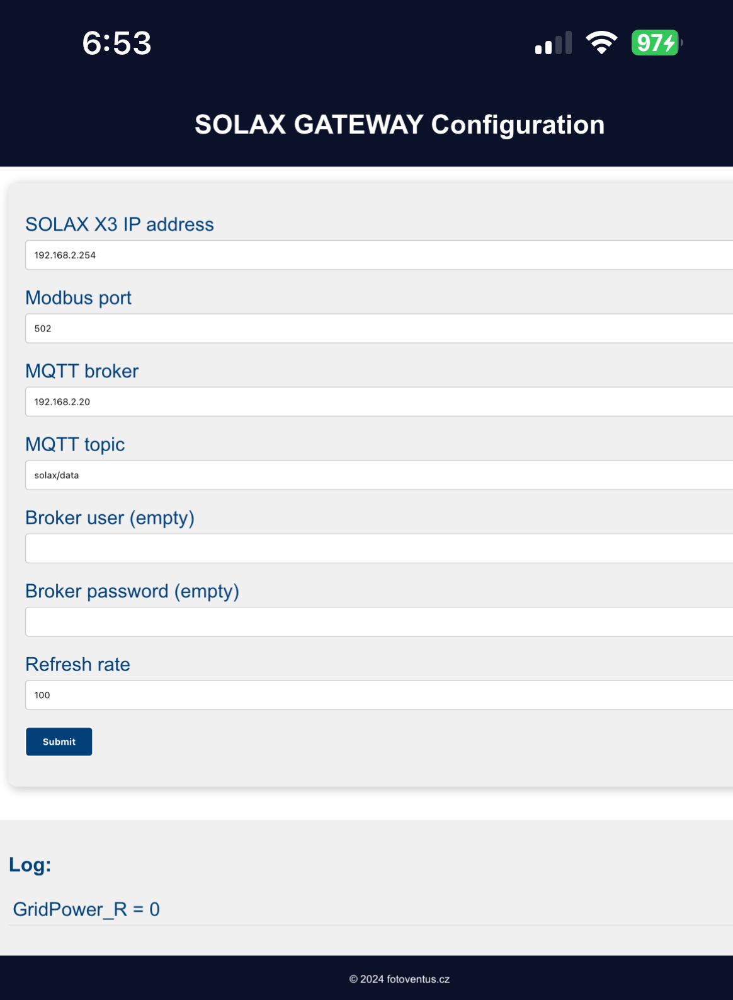

# Gateway between SOLAX MODBUS and MQTT
The gateway reads from the MODBAS SOLAX exchange the traffic data and sends it to the preset MQTT Broker. 
The gateway was created because of the need to branch information about the inverter status and consumption for further automation.

## Hardware
The hardware is based on a board equipped with ESP32-WROOM-32 and LAN8720 Ethernet controller. One of the boards is the LilyGO T-ETH-Series, here was specifically designed T-Internet-POE, which can be powered via POE. 

[Link to LilyGO](https://lilygo.cc/products/t-internet-poe?srsltid=AfmBOopORkTOhoKXokBKXhJh9QFOdM9ZnAsVb1GPqPzhONeA0cJKiBjo)

<table>
    <tr>
        <td></td>
     </tr>
</table>

Used pins:
---
| ESP32 GPIO   |  Note                                 |
|--------------|---------------------------------------|
|   GPIO_NUM_5 | LAN8720 RESET                         |
|   GPIO_NUM_23| LAN8720 MDC                           |
|   GPIO_NUM_18| LAN8720 MDIO                          |
|   GPIO_NUM_17| LAN8720 CLK                           |
|   GPIO_NUM_2 | STATUS LED (LED between 3V3 and GPIO) |
|   GPIO_NUM_14| AP JUMER between GND and GPIO - SETUP    |
---

## Firmware

 The gateway is configured using the local AP "SOLAX-GATEWAY". The AP is activated by connecting the AP - SETUP jumper. 
 After connecting to the AP and entering http://192.168.4.1 in the browser, the configuration page is displayed. At the bottom of the page, a single line of log information is displayed.  

 Fixed mqrtt topic:  solax/data

After disconnecting the jumper, the AP is terminated. 

<table>
    <tr>
        <td></td>
     </tr>
</table>

## LED STATE

---
| Status LED | Note |
|------------|------------------------------------------------------------------------
| _______| Ethernet not connected, DHCP failed  |
| ...........|  Modbus error, unable to connect  |
| .   .  .  .|  Gateway runs normally |

## Solax

## TODO
Node Red client 
Change mqtt topic

